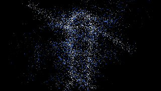
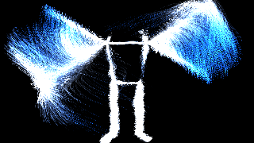
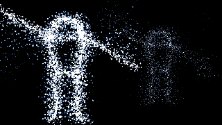
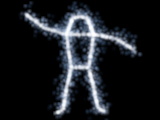

# Resolume × MediaPipe Particle Plugin

カメラで捉えた人の動きを、Resolume の中で GPU パーティクルに変換する FFGL ソースプラグインです。
最大 3 人までの同時トラッキングと、奥行き (z) に応じた遠近表現に対応しています。

```
 カメラ ──► pose_osc.py ──── OSC/UDP ────► FFGL プラグイン (Resolume 内)
          MediaPipe Pose      33点 × 最大3人    1€ フィルタ → 骨格エミッタ
                              約 60 fps        → GPU パーティクル(ping-pong FBO)
```

骨格データを Resolume の中まで持ち込むのがこの構成の要点です。Spout/Syphon で
映像を流し込む方式と違い、パーティクルは Resolume の解像度でネイティブに描画され、
レイヤーのブレンド・エフェクト・オートパイロットがそのまま効きます。

下は実際にこのリポジトリのコードをヘッドレスの OpenGL 4.1 で走らせた出力です
(合成ポーズ、320×180、Mesa ソフトウェアレンダラ)。

| Whole Body / 既定設定 | Limbs + Trails + Body Attract |
| --- | --- |
|  |  |

2 人同時 + 奥行き。左は手前 (z = -0.45)、右は奥 (z = +0.45)。手前の人ほど粒が大きく明るくなります。



## 構成

| パス | 役割 |
| --- | --- |
| `tracker/pose_osc.py` | カメラ → MediaPipe Pose → OSC 送信。複数人のスロット固定もここ。依存は OpenCV と MediaPipe のみ |
| `tracker/send_test_pose.py` | カメラなしで合成ポーズを送るテスト送信機(標準ライブラリのみ) |
| `plugin/src/PoseProtocol.h` | ワイヤフォーマットと骨格定義(Python 側と対になる) |
| `plugin/src/OscPose.*` | 依存ライブラリなしの OSC/UDP 受信 |
| `plugin/src/PoseTracker.*` | 1€ フィルタ、関節速度・奥行き、骨長重み付きエミッション表、presence エンベロープ |
| `plugin/src/ParticleSystem.*` | GPU パーティクル(シミュレーション / 描画 / トレイル / 合成) |
| `plugin/src/MediaPipeParticles.*` | FFGL プラグイン本体とパラメータ |
| `plugin/src/Thumbnail.*` | Resolume のソースブラウザに出すサムネイルを CPU 生成 |
| `plugin/src/TrackerLauncher.*` | プラグインから pose_osc.py を起動・監視。Python 探索、カメラ一覧(DirectShow) |
| `plugin/tests/test_pose.cpp` | GL を必要としない部分のユニットテスト |
| `plugin/tests/headless_render.cpp` | EGL でシェーダーを実際に走らせる描画チェック(Linux) |

## 必要環境

- Resolume Arena / Avenue 7.3.1 以降(FFGL 2.x, OpenGL 4.1 コアプロファイル)
- Windows 10/11 または macOS 11 以降
- Python 3.9 以降 + `opencv-python`, `mediapipe`
- ビルド: CMake 3.15 以降 + MSVC 2019 以降 / Xcode 13 以降

## ビルド

FFGL SDK は自動取得されます。既存のチェックアウトを使う場合は `-DFFGL_SDK_DIR=<path>` を指定してください。

```bash
# Windows (x64) -- GLEW が必要です(FFGL の公開ヘッダが glew.h を include するため)
# 必ず静的リンクにします。動的な x64-windows だと glew32.dll に依存し、
# Resolume はエラーも出さずにプラグインを一覧から外します。
#   vcpkg install glew:x64-windows-static-md
cmake -S plugin -B build -A x64 ^
  -DCMAKE_TOOLCHAIN_FILE=%VCPKG_ROOT%/scripts/buildsystems/vcpkg.cmake ^
  -DVCPKG_TARGET_TRIPLET=x64-windows-static-md
cmake --build build --config Release

# vcpkg を使わない場合: FFGL SDK のチェックアウトに同梱の glew32s.lib を使えます
cmake -S plugin -B build -A x64 -DFFGL_SDK_DIR=C:/path/to/ffgl ^
  -DGLEW_USE_STATIC_LIBS=ON ^
  -DGLEW_INCLUDE_DIR=C:/path/to/ffgl/deps/glew-2.1.0/include ^
  -DGLEW_STATIC_LIBRARY_RELEASE=C:/path/to/ffgl/deps/glew-2.1.0/lib/Release/x64/glew32s.lib
cmake --build build --config Release

# macOS (Universal: x86_64 + arm64 を既定でビルドします)
cmake -S plugin -B build -DCMAKE_BUILD_TYPE=Release
cmake --build build
```

ジェネレータは指定していません。Visual Studio のバージョンは環境によって変わるため、
CMake が見つけたものに任せます。単一アーキテクチャで良い場合は
`-DCMAKE_OSX_ARCHITECTURES=arm64` のように上書きできます。

生成物:

- Windows: `build/Release/MediaPipeParticles.dll`
- macOS: `build/MediaPipeParticles.bundle`

### インストール

Resolume が既定で読むのは `<ドキュメント>\Resolume Arena\Extra Effects\` です
(Avenue は `Resolume Avenue`)。Arena 7.27.1 / Windows 11 で確認したところ、
起動時に走査されるのはこのフォルダだけで、`C:\Program Files\Common Files\FreeFrame\` は
存在せず、走査もされていませんでした。他のフォルダに置く場合は
`Preferences → Video → FFGL Plugins` に追加してください。

- Windows: `<ドキュメント>\Resolume Arena\Extra Effects\`(実機で確認済み)
- macOS: 未確認です。`Preferences → Video → FFGL Plugins` に追加したフォルダに置くのが確実です

新しい DLL を置くと Arena は再起動なしで再走査し、Sources に **Pose Particles** が現れます。
読み込まれたかどうかは `%LOCALAPPDATA%\Resolume Arena\Resolume Arena log.txt` の
`registered extension: 'Pose Particles' uid: MPPT` で確認できます。
名前が出ない場合は、同じログの `Loading plugin` の行を見てください。

入れ替えるときの注意(7.27.1 で確認):

- このソースを使っているクリップが残っていると DLL がロックされ、上書きできません。
  該当クリップを外すか、Arena を終了してから置き換えます。
- 同じパスの DLL を置き換えると、以後に開くクリップは新しいコードで動きますが、
  ソース一覧の名前やパラメータ構成は古い登録のままです。名前やパラメータを変えたときは Arena を再起動してください。
- Sources ブラウザでプラグインを選ぶだけでもプレビュー用のインスタンスが作られ、DLL が掴まれます。
  その場合も差し替えには Arena の終了が必要です。

トラッカーを自動起動させる場合(次節)は、DLL の隣に同名のフォルダを作って次の 2 ファイルを置きます。

```
Extra Effects\
  MediaPipeParticles.dll
  MediaPipeParticles\
    pose_osc.py                  (tracker/pose_osc.py)
    pose_landmarker_full.task    (MediaPipe のモデル。heavy / lite でも可)
```

このフォルダに Python 本体(DLL を含むもの)は置かないでください。Resolume がプラグインとして読みに行きます。

ブラウザ上のサムネイル(160×120、プラグイン起動時に CPU 生成)はこう表示されます。



## 使い方

### プラグインからトラッカーを起動する(既定)

1. mediapipe と OpenCV を入れた Python を用意する(一度だけ)。

```bash
py -3.10 -m pip install -r tracker/requirements.txt
curl -LO https://storage.googleapis.com/mediapipe-models/pose_landmarker/pose_landmarker_full/float16/latest/pose_landmarker_full.task
```

2. 上の「インストール」の配置で `pose_osc.py` とモデルを置く。
3. Resolume でソースをクリップに置く。**置いた時点でトラッカーが起動**します(再生しなくても起動します)。
4. **Camera** グループの `Camera` でカメラを選ぶ。選び直すと 0.4 秒後にトラッカーが起動し直します。

| パラメータ | 既定 | 説明 |
| --- | --- | --- |
| Tracker | on | 自動起動の有無。表示名に状態が出ます(`Tracker: Running` など、下表) |
| Camera | 最初の実カメラ | Windows は DirectShow のカメラ名一覧。並び順は OpenCV の `CAP_DSHOW` の番号と同じです。既定は NDI / OBS / 「仮想」などの仮想カメラを飛ばした最初の 1 台(仮想カメラは入力が無いと真っ黒なため) |
| People | 1 | 同時に追う人数(1〜3) |
| Preview Window | off | 検出した骨格を描いたウィンドウを出す |
| Restart Tracker | — | トラッカーを起動し直し、カメラ一覧と Python も探し直す(カメラを後から挿したとき、mediapipe を入れたあと) |

| 表示 | 意味と対処 |
| --- | --- |
| Running | 起動中 |
| Starting | Python を探している / 起動中 |
| No Python | mediapipe と cv2 が入った Python が無い。入れてから `Restart Tracker` |
| No Script / No Model | `MediaPipeParticles\` フォルダに `pose_osc.py` / `.task` が無い |
| Stopped | トラッカーが自分で終了した(カメラが他のアプリに使われている等)。5 秒ごとに再試行 |
| Off | `Tracker` が off |

- Python は `py -3.12` → `-3.11` → `-3.10` → `-3.13` → `-3.9` → PATH の `python.exe` → `py -3` の順に探し、
  `mediapipe` と `cv2` が import できる最初のものを使います。`py` の既定は最新版で、mediapipe の対応より新しいことが多いためです。
  環境変数 `MPP_PYTHON`(python.exe のフルパス)で固定、`MPP_TRACKER_DIR` でスクリプトとモデルの場所を変えられます。
- トラッカーの出力は `%LOCALAPPDATA%\MediaPipeParticles\tracker-<ポート>.log` に残ります
  (探した Python と終了コード、実行したコマンドライン、pose_osc.py の表示)。
- トラッカーは同じ `OSC Port` のクリップ全体で 1 つです。最初に置いたクリップの設定で起動し、
  以後はどのクリップで Camera グループを変えても、最後に変えた設定に切り替わります。
  後から置いたクリップの既定値で、動いているトラッカーがカメラ 0 に戻されることはありません。
- そのポートのクリップが全部なくなるとトラッカーは止まります。Resolume が落ちた場合も
  Windows のジョブオブジェクトで一緒に終了するので、カメラを掴んだまま残りません。
- ウィンドウは出ません(`Preview Window` を on にしたときのプレビューだけ)。

### 手動でトラッカーを起動する

`Tracker` を off にして、自分でコマンドを実行します。別 PC のカメラを使う場合もこちらです。

```bash
python3 tracker/pose_osc.py --model pose_landmarker_full.task --preview
```

`--model` は実質必須です。現行の mediapipe(0.10.35 で確認)には旧 `mp.solutions.pose` が無く、
`--model` なしでは起動時にその旨を表示して終了します。Windows では `python3` の代わりに `py` を使ってください。

カメラの前に立つと、パーティクルが体の輪郭から湧き出します。

カメラは開けたのに `no frames from device ... try another --backend` が出る場合、
OpenCV の既定バックエンドがそのカメラから映像を取れていません。
Windows では `--backend dshow` を試し、それでも駄目なら `--device 1` などで別の機器を指定します。
動作確認用に、カメラの代わりに動画ファイルも渡せます(`--device clip.mp4`)。

別 PC のカメラを使う場合は送信先を指定します(受信側はプラグインの `OSC Port`)。

```bash
python3 tracker/pose_osc.py --target 192.168.1.20:9010
```

複数の Resolume インスタンスへ同時送信するときは `--target` を並べます。

### 複数人トラッキング(最大 3 人)

複数人は MediaPipe Tasks の PoseLandmarker が必要です(旧 `mp.solutions.pose` は 1 人専用)。
モデルを一度ダウンロードして `--model` で渡します。

```bash
curl -LO https://storage.googleapis.com/mediapipe-models/pose_landmarker/pose_landmarker_full/float16/latest/pose_landmarker_full.task
python3 tracker/pose_osc.py --model pose_landmarker_full.task --people 3 --preview
```

MediaPipe は検出結果の並び順を保証しないため、トラッカー側で前フレームの重心に対する
最近傍マッチングを行い、同じ人が同じスロット (`personId`) に留まるようにしています。
スロットが入れ替わると、その人に付いていたパーティクルごと入れ替わってしまうためです。
`--match-radius`(既定 0.35、画面幅比)で許容移動量を調整できます。
プレビューではスロットごとに色と `#0` `#1` `#2` の番号が表示されます。

パーティクルの総数は全員で分け合います(骨の長さ比で配分)。
1 人が退場するとその分が残った人に戻るので、総粒数は一定に保たれます。

### カメラなしで動作確認

```bash
python3 tracker/send_test_pose.py --port 9010
python3 tracker/send_test_pose.py --port 9010 --people 3   # 奥行き違いの 3 人
```

合成の「手を振る人」が送られます。パーティクルが出れば、受信とレンダリングは正常です。
出ない場合は切り分けがトラッカー側に絞れます。`--people 3` は手前/奥を交互に配置するので、
`Depth` パラメータの効きを確認できます。

## パラメータ

Resolume 上では **Emission / Forces / Look / Tracking** の 4 グループに分かれて表示されます。
スライダーは全て 0〜100% です(FFGL 2 のどのホストでも意味が変わらないため、ホスト側の
レンジ宣言は使っていません)。内部で下表の実値に写像されます。

**Emission** — 何をどれだけ出すか

| パラメータ | 0% | 100% | 既定 | 説明 |
| --- | --- | --- | --- | --- |
| Particles | 4,096 | 262,144 | 65,536 | パーティクル数。本番中もそのまま動かせる(下記) |
| Life | 0.2 s | 8 s | 2 s | 寿命 |
| Life Random | 0 | 1 | 0.5 | 寿命のばらつき。0 にすると全体が脈打つ |
| Emit Spread | 0 | 2 | 0.35 | 発生時のランダム初速 |
| Inherit Motion | 0 | 2 | 1.0 | 関節速度をどれだけ受け継ぐか。動きの表現の中核 |
| Emit From | Whole Body / Limbs / Torso / Joints | | Whole Body | 発生源の絞り込み |
| Reset | — | — | — | パーティクルを全消去して再生成 |

**Forces** — 出たあとどう動くか

| パラメータ | 0% | 100% | 既定 | 説明 |
| --- | --- | --- | --- | --- |
| Gravity | -2 | 2 | 0 | 負で上昇 |
| Turbulence | 0 | 3 | 0.5 | カールノイズの強さ |
| Turbulence Scale | 0.2 | 12 | 3.0 | ノイズの細かさ |
| Drag | 0 | 6 | 1.2 | 空気抵抗。上げるほど体に張り付く |
| Body Attract | -4 | 4 | 0 | 正で骨格に吸着、負で反発 |

**Look** — 見た目

| パラメータ | 0% | 100% | 既定 | 説明 |
| --- | --- | --- | --- | --- |
| Size | 0.5 px | 24 px | 3 px | 1080p 基準。解像度に応じて自動スケール |
| Size Random | 0 | 1 | 0.5 | 粒径のばらつき |
| Depth | 0 | 4 | 1.0 | 奥行き (z) で粒径と輝度を変える。0 で完全に無効 |
| Trails | なし | 約 2 s | 0 | 残像の減衰時間。フレームレート非依存 |
| Brightness | 0 | 4 | 1.0 | 加算合成なので 1 超で発光する |
| Opacity | 0 | 1 | 1.0 | 出力全体の不透明度 |
| Color A / Color B | — | — | 白 / 青 | 若い粒 → 古い粒のグラデーション |
| Color By | Age / Speed | | Age | Speed は速い粒ほど Color B に寄る |

**Tracking** — カメラ映像の当てはめと入力

| パラメータ | 0% | 100% | 既定 | 説明 |
| --- | --- | --- | --- | --- |
| Smoothing | 0 | 1 | 0.5 | 1€ フィルタ。0 は生に近く、1 は重い |
| Mirror | off / on | | on | 演者から見て鏡像にする |
| Zoom | 0.2 | 3.0 | 1.0 | カメラ画角の当てはめ |
| Position X / Y | -1 | 1 | 0 | 位置合わせ |
| OSC Port | — | — | 9010 | 受信ポート(テキスト入力) |

Resolume のパラメータは OSC / MIDI にそのままマップできるので、
`Body Attract` や `Trails` をフェーダーに割り当てて手で押さえる運用が実用的です。
`Particles` も本番中に動かせます(下記「設計上のポイント」)。

### 出だしの設定例

- **輪郭のきらめき**: Drag 高め、Turbulence 低め、Life 短め、Emit From = Whole Body
- **軌跡を引く翼**: Trails 0.6、Body Attract 高め、Emit From = Limbs、Color By = Speed
- **煙のように崩れる体**: Gravity 負、Drag 低め、Turbulence 高め、Life 長め
- **奥行きを強調**: Depth 2.0 前後、Size 小さめ、Size Random 低め(遠近差が読みやすくなる)

## OSC プロトコル

トラッカーとプラグインの間はこれだけです。他の OSC ソフトからも同じ形式で送れます。

```
/mp/pose   ,ii f×132   frameId, personId, 各ランドマークの (x, y, z, visibility)
/mp/clear  ,i          frameId             — 誰も検出されていない(全員フェードアウト)
/mp/clear  ,ii         frameId, personId   — その人だけ退場した
```

- ランドマークは MediaPipe Pose の 33 点、順序もそのまま
- `x`, `y` は 0..1(画像左上原点)、`z` は概ね x と同スケールで手前が負、`visibility` は 0..1
- `personId` は 0 起点。`MAX_PERSONS`(3)以上は取り違えを避けるため破棄されます
- `personId` は省略可能で、その場合は 0 とみなされます(1 人用の送信側と互換)
- 32bit ビッグエンディアン、OSC 1.0 のバンドルにも対応(1 バンドルに複数人を詰められます)

`/mp/clear` を受け取る、あるいは 0.5 秒パケットが途切れると、プラグインは
点滅せずにフェードアウトします。人ごとに独立した包絡線なので、1 人が退場しても
残りの人は影響を受けません。

## 設計上のポイント

- **1€ フィルタ**: 静止時は強く平滑化し、速い動きでは追従を優先します。固定ローパスと違い、
  手を振っても残像のように尾を引きません。速度推定は生入力の差分から取っており、
  フィルタ遅れの分だけ過大評価されないようにしています(パーティクルがこの速度を継承するため)。
- **骨長重み付きエミッション**: 骨ごとの CDF を毎フレーム CPU で作り、シェーダー側は
  乱数 1 つで発生位置を選びます。長い骨に比例して粒が乗るので、腕だけが濃くなりません。
  両端の visibility が低い骨は重み 0 になり、隠れた部位からは発生しません。
- **presence エンベロープ**: 立ち上がりは速く、消えるときは遅い非対称の包絡線。
  検出が 1 フレーム落ちても画が瞬きません。
- **発生のばらけ**: 寿命切れの粒は毎フレーム確率的に再生成されるため、
  人が入ってきたときに一斉には出ずに立ち上がります。
- **依存ゼロの OSC**: プラグインは Resolume のプロセス内にロードされるので、
  追加の共有ライブラリは配布事故のもとです。必要な範囲だけ自前で実装しています。
- **奥行きはコストゼロで載せている**: 位置テクスチャの w 成分は未使用の乱数を持っていたので、
  そこを発生時の z に置き換えました。テクスチャも帯域も増えていません。
  z は生成時に確定させています。毎フレーム引き直すと粒が泳いで見えるためです。
- **複数人は 1 本の CDF で扱う**: 全員の骨を 1 つの累積分布にまとめているため、
  シェーダー側は乱数 1 つで「誰のどの骨か」まで決まります。分岐もループも増えません。
  presence を重みに掛けているので、退場中の人の取り分は自動的に他へ回ります。
- **ユニフォーム量の見積もり**: 3 人分で 651 コンポーネント。
  OpenGL 4.1 のフラグメントシェーダー保証値 1024 に収まる範囲で `MAX_PERSONS` を決めています。
  これ以上増やすなら関節データをテクスチャに移す必要があります。
- **サムネイルは実行時に生成**: 骨格テーブルから CPU で描いているので、
  4 分の 1 メガバイトの 16 進ダンプをリポジトリに置かずに済み、
  骨の定義を変えてもアイコンだけ古い骨格を映し続けることがありません。
- **ホストの GL ステートから身を守る**: プラグインは Resolume のコンテキストを共有します。
  ホストが scissor / カリング / ステンシル / カラーマスクを残していると、こちらの描画が
  黙って切り取られたり真っ黒になったりします(「テストでは動くのにホストでは黒い」の典型)。
  自分が触る分は全て退避してから強制し、終了時に戻します。
  逆に、こちらが変えたまま放置してホスト側の描画を壊すこともありません。
- **同じポートのインスタンスは 1 本のソケットを共有する**: Arena ではクリップスロットごとに
  プラグインのインスタンスができ、一度再生したクリップは別のクリップに切り替えたあとも受信を続けます。
  以前はインスタンスごとにソケットを開いていたため、Windows では `SO_REUSEADDR` で 2 つ目の bind も
  成功してしまい、データグラムは片方にしか届きませんでした。列 1 → 列 2 と切り替えると、
  画面に出ている列 2 が真っ黒になります(Arena 7.27.1 で再現)。
  今はプロセス内でポートごとに受信スレッドを 1 本だけ持ち、全インスタンスに同じポーズを配ります。
  ソケットは排他的に確保するので(Windows は `SO_EXCLUSIVEADDRUSE`)、別プロセスが同じポートに
  割り込んで一部を横取りすることもありません。
- **OSC の bind は失敗したら諦めない**: コンポジション読み込み時はポートが一瞬塞がっていることがあります
  (別プロセスがまだ掴んでいる、OS がソケットを解放しきっていない等)。
  2 秒間隔で再試行するので、1 回の bind 失敗でその後ずっと無反応になることはありません。
- **粒数変更で画が飛ばない**: `Particles` を変えるとテクスチャは作り直しますが、
  旧テクスチャから重なる範囲を `glBlitFramebuffer` でコピーしてから差し替えます。
  生きている粒は状態を保ったままなので、本番中にフェーダーで動かせます。

## 動作確認済みの内容

このリポジトリで実際に検証したこと:

- `plugin/tests/test_pose.cpp` — OSC パーサ(バンドル / 複数人 / 破損パケット / 途中切れ /
  範囲外 personId)、1€ フィルタの収束・ノイズ減衰・速度推定、座標変換とミラー、
  奥行きのスケールとフィルタ、エミッション表、presence エンベロープ、
  複数人のスロット独立性と CDF 配分、実ソケットでの往復、
  bind 失敗後にポートが空いたら復帰すること、同じポートの受信機が全員同じパケットを受け取ること、
  外部のソケットが `SO_REUSEADDR` でポートに割り込めないこと。`ctest` で全て通過。
- Python が実際に送るバイト列を C++ パーサに読ませ、1 人 / 複数人 / 全体クリア /
  個別クリアの全ケースで値が一致することを確認。
- `send_test_pose.py --people 3` → `PoseReceiver` → `PoseTracker` を実際に 2 秒走らせ、
  354 パケット受信・3 人同時 presence 1.0・奥行きと関節速度・CDF 配分を確認。
- スロット固定ロジックを Python 側で検証(検出順が入れ替わっても人が同じ番号に留まること、
  退場時にスロットが解放されること)。
- 6 本のシェーダーを `glslangValidator` で単体検証し、4 組のプログラムをリンク検証。
- Resolume FFGL SDK(master)に対してプラグイン全体をビルドし、`plugMain` の
  エクスポートを確認。
- Mesa の OpenGL 4.1 コアプロファイル(EGL surfaceless)で `ParticleSystem` を
  90 フレーム実行し、GL エラーなしでパーティクルが描画されることを確認。
  既定 / トレイル+吸着+部位別+速度カラー / 2 人+奥行き / 粒数の無停止変更 /
  敵対的なホスト GL ステート の 5 構成を実行済み。
  最後の構成は、ガードを外すと実際にフレームが真っ黒になる(lit 8431 → 0)ことを
  確認してからテストとして採用しています。

### Windows 実機(Resolume Arena 7.27.1 / Windows 11 / NVIDIA, OpenGL 4.1)

2026-09-16 に実機で確認したこと:

- DLL の依存は `WS2_32` `OPENGL32` `KERNEL32` と VC ランタイム(`MSVCP140` `VCRUNTIME140` 等)のみ。
  `glew32.dll` への依存が無いことを `dumpbin /dependents` で確認し、エクスポートは `plugMain` / `SetLogCallback`。
- `Extra Effects` に置くと再起動なしで `registered extension ... uid: MPPT category: 3` が記録され、Sources に出る。
  パラメータ 4 グループ、既定値(Particles 256² = 65,536 など)が表の通りに Arena へ渡っている。
- `send_test_pose.py`(1 人 / 3 人 / `--gap` によるフェードアウトと復帰)で描画。ログに GL エラーなし。
- 列 1 を再生してから列 2 に切り替えると列 2 が真っ黒になる不具合を発見し、共有ソケットで修正。
  修正後は切り替えても描画が続き、UDP 9010 のソケットが 1 本だけであることを確認。
- `pose_osc.py --model ... --people 3 --device <人が映った動画>` で、実際の MediaPipe 検出
  (約 22 fps、検出率 93〜100%)からパーティクルが体の動きに追従することを確認。

- トラッカー自動起動(`TrackerLauncher`)を実カメラで通しテスト(`MPP_E2E_CAMERA=4` で `mpp_tests`):
  `py -3.10` を自動で選び(3.12 / 3.11 は mediapipe 無しで除外)、空白を含む `Extra Effects` のパスから起動、
  1 秒で Running、`USB Video Device`(DirectShow 4 番)から約 26 fps、3 秒間の 50 更新中 46 で人を検出。
  最後の参照を離すと 1.5 秒間の受信 0、python プロセスも残らないことを確認。
- DirectShow のカメラ一覧(8 台)と OpenCV `CAP_DSHOW` の番号が一致すること(0〜7 は開けて 8 は開けない、
  解像度と輝度が各機器と対応)。

- Arena の中での自動起動(Arena 再起動後に確認):
  - 再生していないクリップに置いただけでトラッカーが起動し、`Camera` に 8 台の名前、`People` / `Preview Window` /
    `Restart Tracker` / `Tracker` が並ぶ。プラグインの登録(Sources への表示)だけでは起動しない。
  - `Camera` を変えると `--device 4` で起動し直す。`Tracker` を off でプロセスが消え、on で再起動。
  - 2 つ目のクリップを既定値のまま置いて再生しても、動いているトラッカーはカメラ 4 のまま。
  - 片方を消しても動き続け、最後のクリップを消すとプロセスが消える。
  - 既定カメラは、この PC では 0〜3 番の NDI Webcam を飛ばして `USB Video Device`(4 番)になった。
  - `MediaPipeParticles\` サブフォルダも Arena に走査されるが、プラグインとしては 0 件で無害。

確認できていないこと:

- Arena の画面上で `Tracker: Running` などの表示名が更新されること(REST からはパラメータ名しか見えないため)。
- Arena の出力で、カメラに人が映った状態のパーティクル(確認時はカメラの前に人がいなかった。
  同じカメラでの検出はプラグイン外の通しテストで、描画は動画入力で確認済み)。
- 手動起動の `pose_osc.py` を既定の `--device 0` で試した際に真っ黒だったのは、0 番が
  `NDI Webcam Video 1`(NDI 入力なし)だったためで、カメラの故障ではありません。
- 最初に作ったインスタンスが途中から、粒が画面全体に噴き出すような見た目に崩れました
  (輝度が通常の約 3 倍、`Reset` でも戻らない)。同じ入力の順番を新しいインスタンスで再現しても起きず、
  新しいインスタンスを 10 分以上動かしても起きていないため、原因は特定できていません。
  本番前に長時間の通し確認をしてください。
- macOS 実機。

### CI

`.github/workflows/mediapipe-particles.yml` が push / PR ごとに以下を回します。

| ジョブ | 内容 | 状態 |
| --- | --- | --- |
| Linux | ビルド + `ctest` + ヘッドレス描画 5 構成 + トラッカーの構文チェック | 通過 |
| Windows | vcpkg で GLEW を入れて x64 DLL をビルド + `ctest` + `dumpbin` で `plugMain` を確認 | 通過 |
| macOS | Universal バンドルをビルド + `ctest` + `lipo` / `nm` でアーキテクチャと `plugMain` を確認 | 通過 |

**3 プラットフォームすべてでビルドとテストが通っています。**
Windows の DLL は以下のエクスポートを持つことを確認済みです。

```
ordinal hint RVA      name
      1    0 0000FAC0 SetLogCallback
      2    1 0000FB30 plugMain
```

成果物(DLL / .bundle)は Actions の artifact からダウンロードできます。

CI を組んだことで、この環境では再現できない実機固有の問題が 3 件見つかりました。
いずれも CI 特有の問題ではなく、Windows / macOS で手元ビルドする人が必ず踏むものでした。

- macOS の Universal ビルドで `CMAKE_OSX_ARCHITECTURES` が FFGL SDK 側に伝わっておらず、
  SDK が arm64 のみでビルドされて x86_64 のリンクが全滅していた
  (Apple Silicon ネイティブの Resolume 7.11+ は x86_64 のみのプラグインを読み込めません)
- FFGL SDK は GLEW を `PRIVATE` リンクしているのに公開ヘッダ `FFGL.h` が
  `<GL/glew.h>` を include しているため、利用側で GLEW を再リンクする必要があった
- `winsock2.h` 経由の `windows.h` が `min`/`max` をマクロ定義し、`std::max` を壊していた

## 既知の制約

- 人数は最大 3 人です。増やすには `PoseProtocol.h` の `MAX_PERSONS` と
  `pose_osc.py` の同名定数を揃えて変更しますが、4 人を超えるとユニフォーム量が
  OpenGL 4.1 の保証値に近づくため、関節データのテクスチャ化が必要になります。
- 奥行き (`z`) は粒径と輝度に効きますが、シミュレーション自体は 2D です。
  奥の人が手前の人に隠れることはありません(加算合成なので順序に依存しません)。
- 同じ Resolume の中なら、何個のクリップ・レイヤーに置いても同じ `OSC Port` で全員が受信します。
  別のプロセス(Arena と Avenue を同時に起動する等)とは同じポートを共有できないので、
  そちらは `OSC Port` を変えて、トラッカー側で
  `--target 127.0.0.1:9010 --target 127.0.0.1:9011` のように並べて送ってください。
- FFGL のプラグイン名は 16 文字までです(超えた分は Resolume が切り捨てます)。
  そのためソース名は `Pose Particles` にしています。
- MediaPipe の `z` は単眼推定で、絶対距離ではありません。人が横を向いたときなどは
  それなりに揺れます。`Depth` を上げすぎると粒径がちらつきます。
- プラグインの FFGL ユニーク ID は `MPPT` です。他のプラグインと衝突する場合は
  `MediaPipeParticles.cpp` の `PluginInfo` で変更してください。

## ライセンス

FFGL SDK は Resolume のライセンス(BSD 3-clause)に従います。

本ディレクトリのコードのライセンスは未設定です。リポジトリのルートに `LICENSE` が無く、
どのライセンスにするかは作者が決めることなので、こちらでは選んでいません。
配布する前に決めて追加してください。
